# webdemos
Web Demos  
https://kishida.github.io/webdemos/

## スキル

[Unsloth Desktopで画像生成](skills/unsloth-media.zip)  
[和笛](skills/wafue-sfx.zip)  
[FM音源](skills/fm-synth.zip)  

2026/10/08

## フライトシミュレーター

[フライトシミュレーター](flightsim/index.html)  
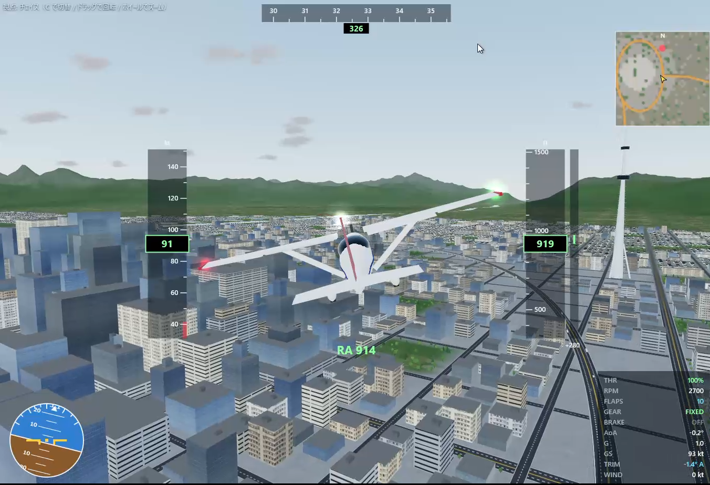

2026/10/08

## Qwen Image 2.1

[Qwen Image 2.1作品](qwenimage/index.md)

## 森をあるく

[森をあるくだけのゲーム](valleywalk/index.html)  
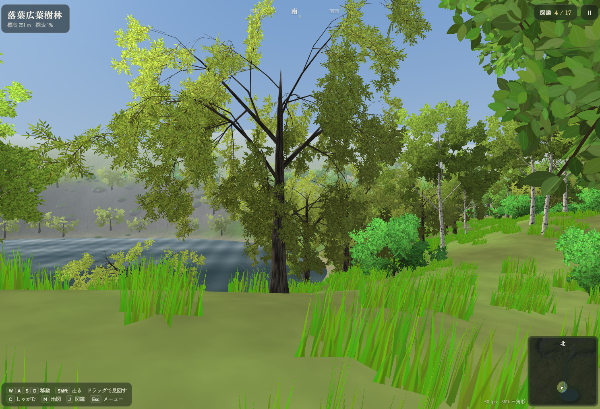

## Qwen3.8-27B

[Qwen3.8-27B作品](qwen38/index.md)

## ギャルゲー

Opus5.5+Qwen Image 2.1でのギャルゲー

[桜色メモリアル](galge/index.html)  
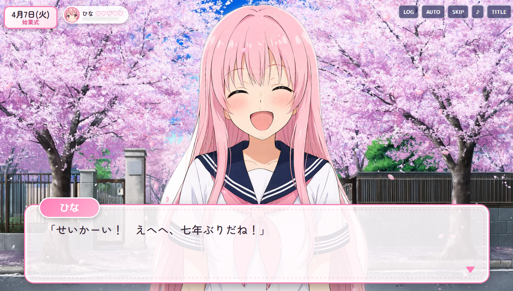

[桜色メモリアル 実写版](galge/live.html)  
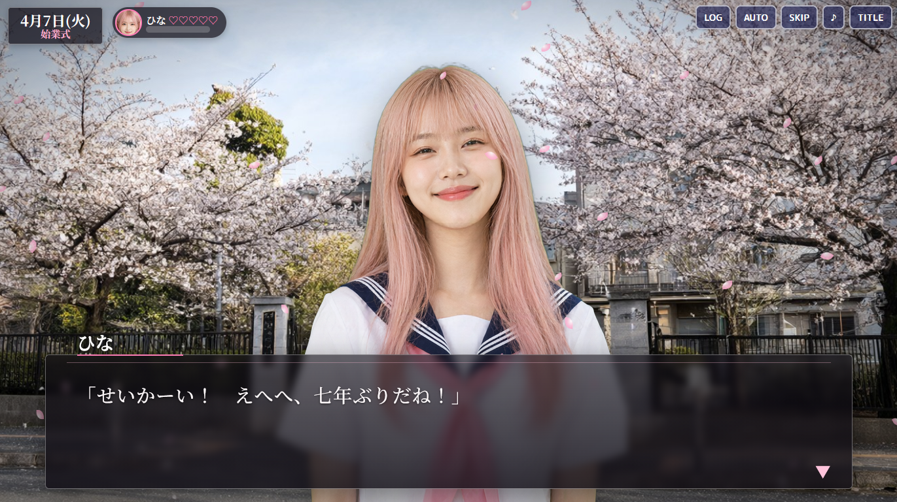

2026/10/03

## ダンジョン

Opus5.5+Qwen Image 2.1でのダンジョンRPG

[魔王の迷宮と囚われの姫](dangeon/game/index.html)  
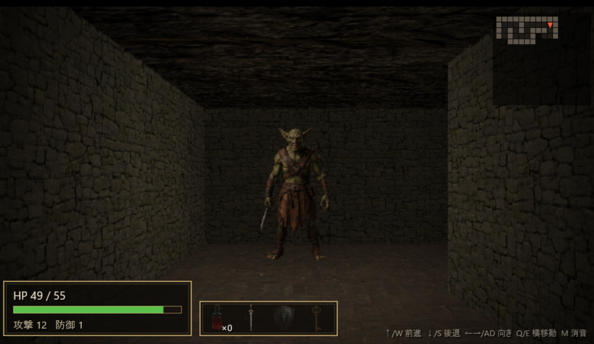

2026/10/03

## あらくれ32環状クラッシュレース

Opus5.5+Blenderを使ってモデリングした32をぶっこわしていくゲーム

[あらくれ32環状クラッシュレース](hcr32/index.html)  
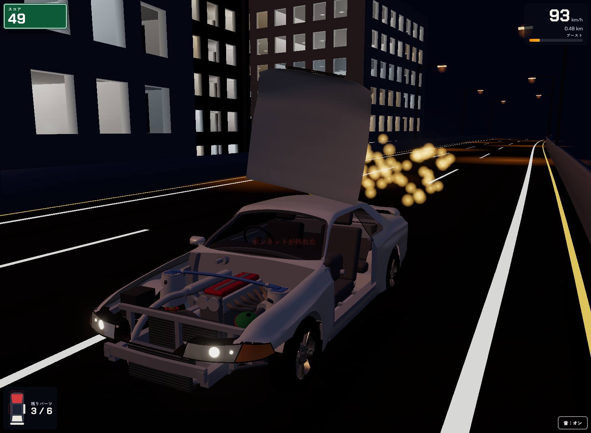

2026/09/28

## Amp Sim

Opus4.8によるアンシミュ

[Guitar Amp Simulator](ampsim/guitar-amp-sim.html)  
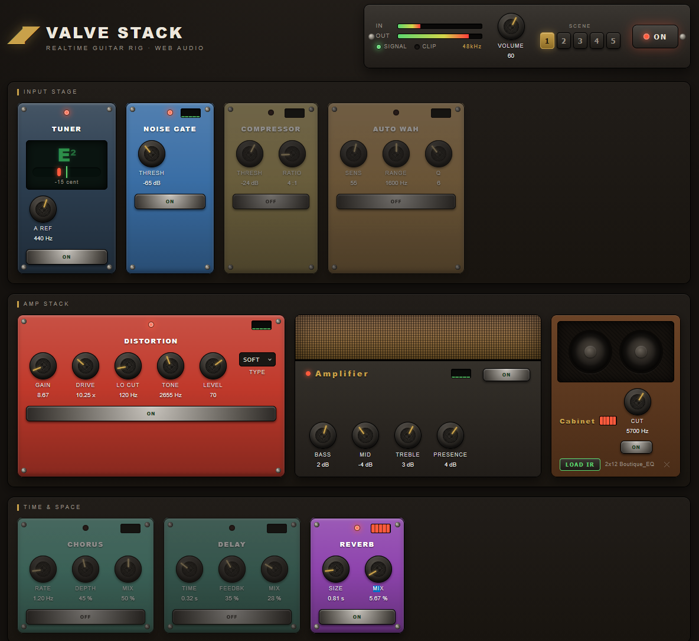  

2026/06/26

## EC Demo
[EC Demo](ecdemo/ec-demo.html)  
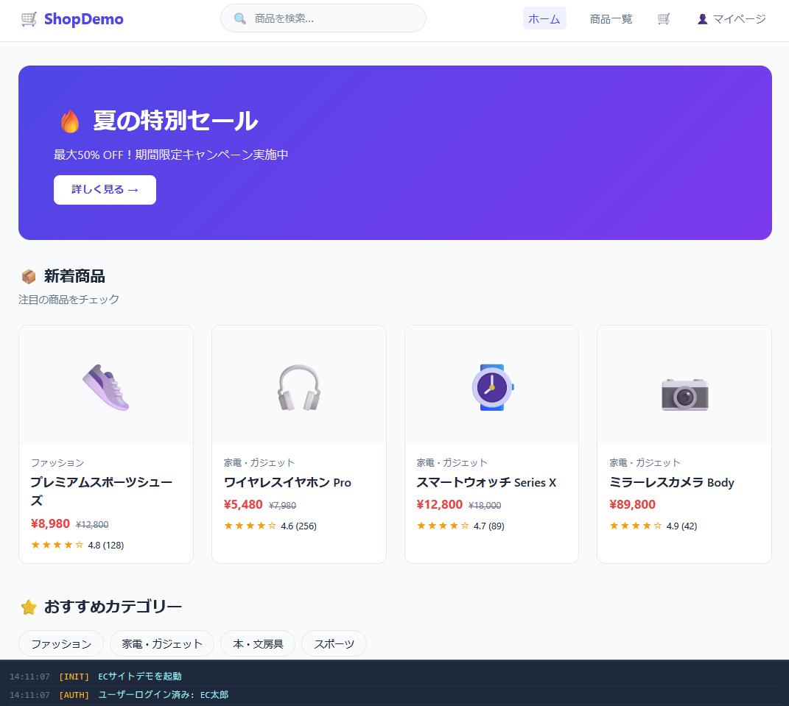  

[Design](ecdemo/ec-design.html)

2026/05/09

## 3D RPG

Qwen3.6-27Bが出力したRPG

[3D RPG](rpg/rpg.html)  
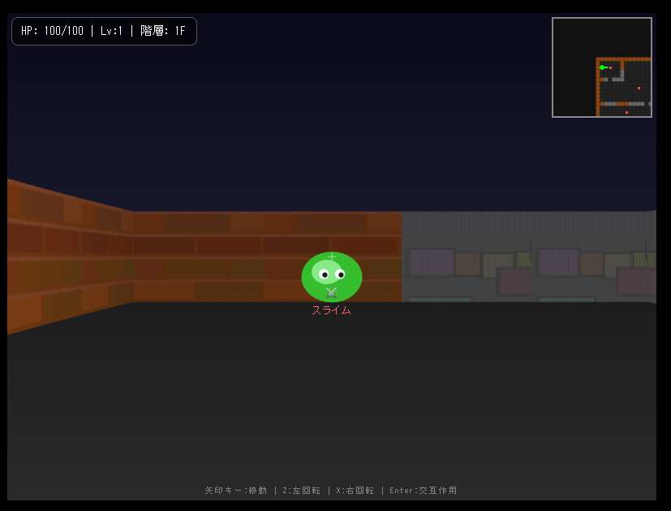  
2026/4/27

## Parachute

手書き画像を使ってOpus4.6で作ったゲーム

[Parachute](parachute/paragame.html)  
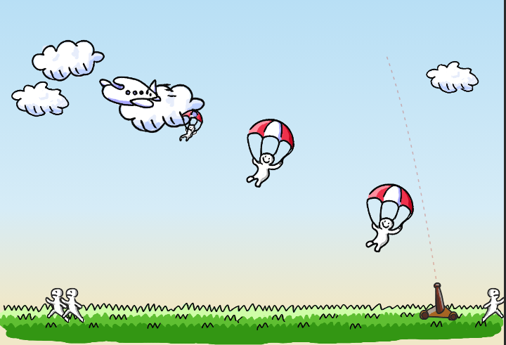  
2026/4/27

## YOKOGAME

手書き画像を使ってOpus4.6で作ったシューティングゲーム
[Yoko Game](yokogame/game.html)  
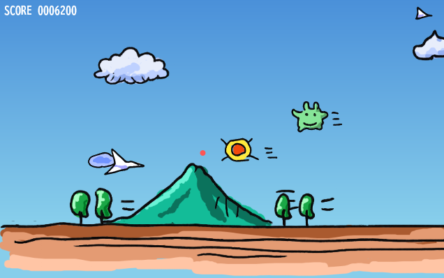  
2026/4/23

## Local Translator
[Local Translator](translator/offline-translator.html)  
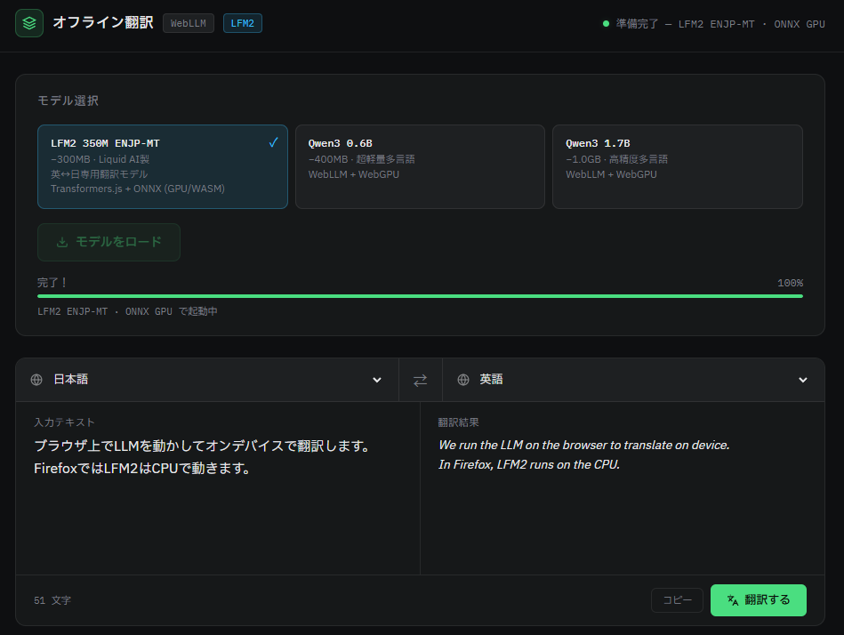

## Error Diffusion

[Error Diffusion](dither/dither_demo.html)  
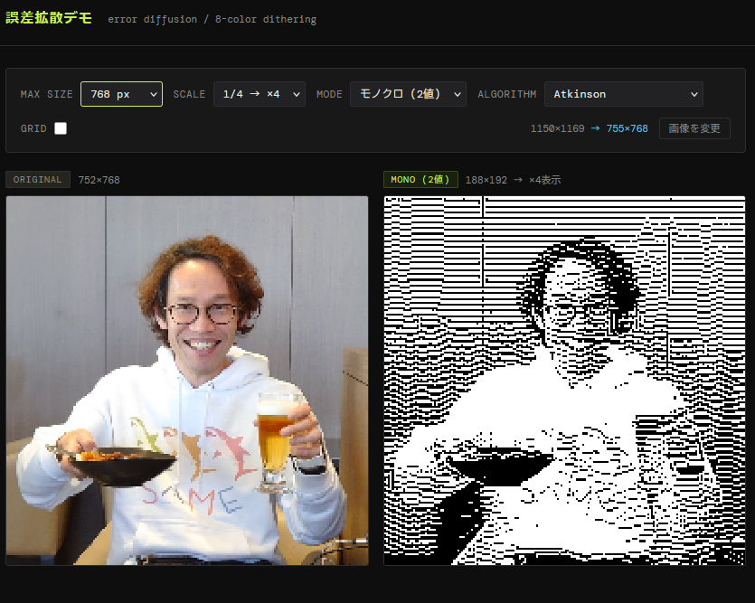
