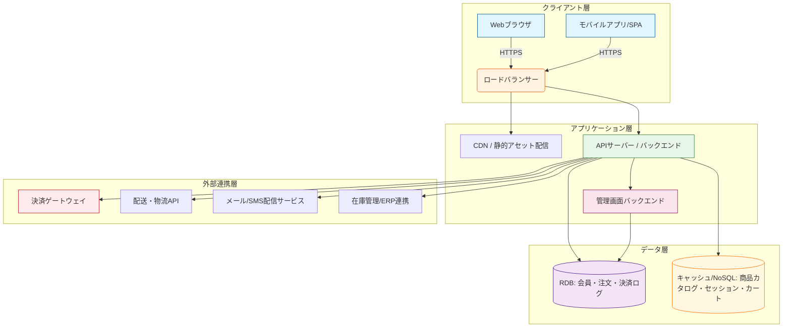
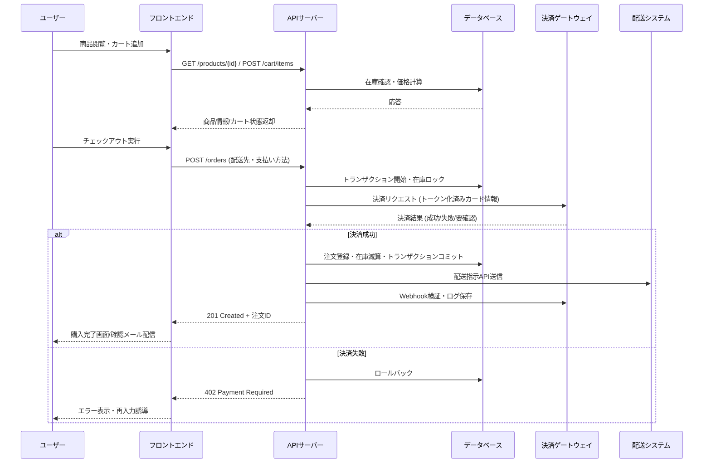

# ECサイトのシステム設計図（Markdown + Mermaid）

以下は、ECサイトを構築する際の標準的なシステム設計を、Mermaid記法で可視化したものです。GitHub・GitLab・Obsidian・VS Code などのMermaid対応環境でそのままレンダリングできます。

---

## 1. システム全体アーキテクチャ図

> **レイヤー説明**
> - `クライアント層`: ユーザーが直接触れる画面。CDNで静的ファイル（画像・CSS/JS）を配信し、API通信はHTTPS限定。
> - `アプリケーション層`: 業務ロジック・認証・認可・決済フロー制御を担当。管理画面と一般ユーザー向けAPIは分離推奨。
> - `データ層`: RDBはトランザクション処理（注文・会員）、キャッシュ/NoSQLは読み取り頻度が高い商品情報やセッションに最適化。
> - `外部連携層`: 決済・配送・通知・既存業務システムとの連携。フェイルセーフとリトライ機構を必ず実装。

---

## 2. コア機能モジュール構成

| モジュール | 主要機能 | 設計ポイント |
|-----------|---------|-------------|
| **会員管理** | 登録/ログイン/パスワードリセット/プロフィール | OAuth2/OIDC、MFA対応、GDPR/個人情報保護法準拠 |
| **商品カタログ** | 検索・フィルタ・カテゴリ・レビュー・在庫表示 | 全文検索(Elasticsearch/Meilisearch)、画像最適化、SEOメタタグ自動生成 |
| **カート・注文** | カート保持・数量変更・クーポン適用・配送方法選択 | セッション/DB両対応、重複購入防止、トランザクション分離レベル設定 |
| **決済・支払い** | クレジットカード・コンビニ・銀行振込・後払い | PCI-DSS準拠、サロゲートトークン化、Webhook受信処理 |
| **配送・在庫** | 注文確定→倉庫指示→追跡番号発行・在庫減算 | 非同期キュー(RabbitMQ/SQS)、在庫ロック/楽観的排他制御 |
| **管理画面** | 商品登録・注文一覧・売上集計・ユーザー管理 | RBAC（役割ベースアクセス制御）、監査ログ、CSVインポート/エクスポート |

---

## 3. 主要データフロー図（購入〜決済完了）

---

## 4. 推奨技術スタック（例）

| 層 | 選択肢 | 選定基準 |
|----|--------|---------|
| フロントエンド | Next.js / Nuxt / React + Vite | SSR/SSG対応、SEO、開発者体験 |
| バックエンド | Node.js(NestJS) / Python(FastAPI) / Go(Gin) / Ruby(Rails) | 開発速度 vs パフォーマンス、チームスキル |
| データベース | PostgreSQL + Redis | トランザクション保証、キャッシュ層の分離 |
| インフラ | AWS/GCP/Azure + Docker/K8s + CloudFront | スケーラビリティ、マネージドサービス活用 |
| 決済/配送 | Stripe / PayPal / 楽天ペイメント / ヤマト・佐川API | 手数料、対応通貨、Webhook安定性 |

---

## 5. 設計上の重要ポイント

1. **セキュリティ**
   - HTTPS強制・HSTS・CSRF/XSS対策・SQLインジェクション防止
   - 決済情報は自前で保持せず、トークン化またはサロゲート方式を採用
   - 定期的な脆弱性スキャン & WAF導入

2. **パフォーマンス**
   - 商品画像はWebP/AVIF + CDNキャッシュ + レイジーローディング
   - APIレスポンス時間 < 300ms（P95）、DBクエリ最適化・インデックス設計
   - キャッシュ戦略: Redis/Memcached + HTTP Cache-Control ヘッダー

3. **スケーラビリティ**
   - 初期はモノリスで開発し、ボトルネック発生時にモジュール分割（CQRS/イベントソーシング）へ移行
   - 自動スケールアウト設定・データベースレプリケーション・読み取り専用インスタンス活用

4. **法規制・コンプライアンス**
   - 個人情報保護法・特定商取引法・消費税法（インボイス制度対応）
   - 返品/交換ポリシー明示・年齢確認機能（必要に応じて）

---

## 6. Mermaidの表示方法について

- GitHub / GitLab / Notion / Obsidian / VS Code（Markdown Preview Enhanced拡張）では標準サポート済みです。
- ローカルでHTML出力する場合は、`mermaid-cli` や `mkdocs-mermaid2-plugin` を利用してください。
- 図の配色・フォントはCSSでカスタマイズ可能です。

---

💡 **次のステップ建议**  
1. MVP範囲を定義（商品数・決済手段・配送エリア）  
2. データモデルER図とAPI仕様書（OpenAPI/Swagger）を先行作成  
3. 既存プラットフォーム（Shopify / BASE / EC-CUBE）との比較検討  
4. 本番環境向けCI/CDパイプライン & モニタリング（Prometheus/Grafana, Sentry）設計

必要に応じて、ER図・データベース正規化手順・決済フローのセキュリティチェックリストもMermaid形式で提供可能です。お気軽にお申し付けください。